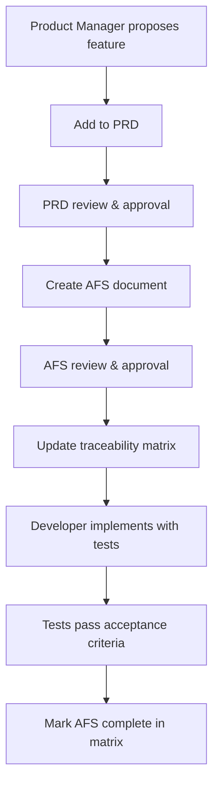
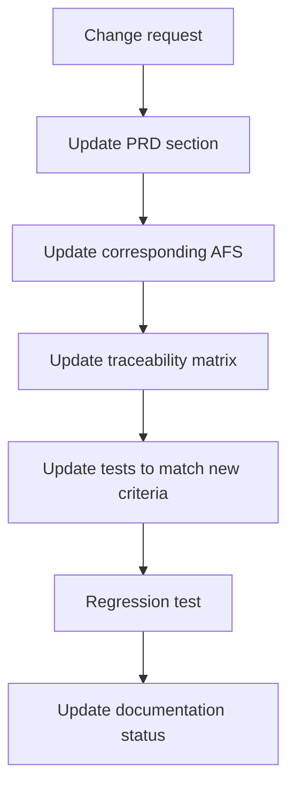

# Documentation Standards

**Version:** 1.0
**Effective Date:** December 6, 2025
**Scope:** Overlord Remake Project
**Owner:** Project Lead

---

## Purpose

This document defines documentation standards for the Overlord remake project, ensuring traceability from requirements to implementation to verification.

**Applicable To:**
- Game development team
- Engineering team
- QA/Testing team
- Technical writers
- Project managers

---

## Core Principles

### 1. Documentation is Executable Specification
Documentation is not overheadit is the **blueprint** that code implements and tests verify. Every feature should have a traceable path:

```
Requirement � Specification � Implementation � Test
```

### 2. Single Source of Truth
Each type of information has exactly one authoritative location:
- **What we're building:** Product Requirements Document (PRD)
- **How it works in detail:** Atomic Feature Specifications (AFS)
- **Proof it works:** Test suites mapped to specifications

### 3. Living Documentation
Documentation evolves alongside code:
- Version controlled in same repository as source code
- Updated before, during, or immediately after code changes
- Reviewed like code (pull request process)

### 4. Accessibility Over Perfection
Better to have 80% complete documentation that's used than 100% perfect documentation that's ignored:
- Write for the intended audience (stakeholders vs. developers)
- Prefer clarity over exhaustiveness
- Update iteratively as understanding deepens

---

## Document Types

### Product Requirements Document (PRD)

**Purpose:** Defines WHAT we're building and WHY
**Owner:** Project Lead
**Audience:** Stakeholders, entire project team

**Required Sections:**
1. **Executive Summary** - One-page overview for decision-makers
2. **Product Vision** - Strategic goals and player value
3. **Features** - High-level feature descriptions with player stories
4. **Success Metrics** - Measurable outcomes (KPIs, acceptance criteria)
5. **Platform/Architecture** - Technology stack and constraints
6. **Timeline** - Milestones and sprint breakdown
7. **Risks** - Known risks with mitigation strategies
8. **Out of Scope** - Explicit non-goals to prevent scope creep

**Size Guidelines:**
- Target: 500-750 lines (30-50 min read)
- Maximum: 1000 lines (beyond this, split into PRD + Technical Design Document)
- Code examples: Use sparingly, prefer appendix files or links

**Template:** See `templates/PRD-template.md`

---

### Atomic Feature Specification (AFS)

**Purpose:** Defines HOW a single feature works in implementable detail
**Owner:** Lead Developer / Feature Owner
**Audience:** Developers, QA, technical reviewers

**Required Sections:**
1. **Summary** - One-line description of the feature
2. **Dependencies** - Other AFS documents this depends on
3. **Requirements** - Detailed functional requirements
4. **Acceptance Criteria** - Testable conditions for "done"
5. **Technical Notes** - Implementation guidance (optional, keep minimal)
6. **Integration Points** - How this connects to other systems

**Characteristics:**
- **Atomic:** Describes ONE feature, not a system
- **Self-contained:** Can be understood without reading entire codebase
- **Testable:** Acceptance criteria are binary (pass/fail)
- **Dependency-explicit:** States what must exist before implementation

**Naming Convention:**
- Format: `AFS-XXX-feature-name.md`
- Numbers grouped by system (see AFS Numbering Scheme below)
- Example: `AFS-023-cost-system.md`

**Size Guidelines:**
- Target: 50-150 lines
- Include code examples only if essential for clarity
- Link to implementation files instead of embedding large code blocks

**Template:** See `templates/AFS-template.md`

---

### AFS Numbering Scheme

Grouped by game system for Overlord remake:

| Range | System | Purpose |
|-------|--------|---------|
| 001-010 | Core Systems | Game State, Turn System, Save/Load, Settings |
| 011-020 | Galaxy Map | Galaxy Generation, Star Systems, Navigation |
| 021-030 | Economy | Resources, Income, Costs, Trading |
| 031-040 | Entities | Entity System, Fleets, Planets, Colonies |
| 041-050 | Combat | Space Combat, Ground Combat, Damage Calc |
| 051-060 | AI | AI Decision Tree, Difficulty, Behaviors |
| 061-070 | Units & Buildings | Unit Stats, Building Stats, Production |
| 071-080 | UI/UX | UI State Machine, HUD, Menus, Mobile |
| 081-090 | Audio/Visual | Audio System, VFX, Shaders |
| 091-100 | Platform | Cross-Platform, Cloud, Achievements |

---

### Traceability Matrix

**Purpose:** Maps PRD features � AFS specifications � test coverage
**Owner:** Tech Lead / QA Lead
**Audience:** Project managers, auditors, compliance teams

**Required Columns:**
1. PRD Section/Feature
2. AFS Document(s)
3. Test Suite(s)
4. Test Count
5. Status (Complete/In Progress/Blocked)

**Update Frequency:** Weekly during active development

**Format:** Markdown table or spreadsheet (exportable to markdown)

**Template:** See `templates/traceability-matrix-template.md`

---

### Test Specifications

**Purpose:** Verify that implementation meets requirements
**Owner:** QA Team / Developers (TDD)
**Audience:** QA engineers, CI/CD systems, auditors

**Required Elements:**
1. **Test name** - Describes what is being tested
2. **AFS reference** - Which spec this validates (e.g., "Tests AFS-023 acceptance criteria 1-3")
3. **Test type** - Unit/Integration/E2E/Manual
4. **Preconditions** - Setup required before test
5. **Steps** - Actions to perform
6. **Expected result** - Pass condition
7. **Actual result** - What happened (for manual tests)

**Coverage Requirements:**
- **P0 (Critical) features:** 100% of acceptance criteria tested
- **P1 (Important) features:** 100% of acceptance criteria tested
- **P2 (Nice to have) features:** 80%+ of acceptance criteria tested

---

## Documentation Workflow

### Adding a New Feature



**Steps:**
1. **Update PRD** - Add feature to appropriate section
   - Include user value statement ("As a user, I want X so that Y")
   - Define success metric (how do we measure success?)
   - Get Product Manager approval

2. **Create AFS** - Write detailed specification
   - Assign next sequential AFS number
   - List dependencies (other AFS that must exist first)
   - Write testable acceptance criteria
   - Get Lead Developer approval

3. **Update Traceability Matrix** - Link PRD � AFS
   - Add row mapping PRD section to AFS number
   - Status: "Planned"

4. **Implement with Tests** - Developer writes code
   - Tests written based on AFS acceptance criteria
   - Implementation matches AFS requirements

5. **Verify & Update Matrix** - Mark complete
   - All acceptance criteria tests pass
   - Update matrix status: "Complete"
   - Note test suite and test count

---

### Changing an Existing Feature



**Requirements:**
- PRD changes require Product Manager approval
- AFS changes require Lead Developer review
- Test changes must maintain/improve coverage
- Traceability matrix updated within 24 hours

**Documentation Changes as Pull Requests:**
- Treat documentation like code
- Submit changes via PR with review
- CI/CD validates links, formatting, compliance

---

## Quality Standards

### PRD Quality Checklist

A PRD is complete when:

- [ ] Executive summary is d1 page
- [ ] All features have user value statements
- [ ] Success metrics are measurable and specific
- [ ] Platform/architecture constraints are defined
- [ ] Risks have mitigation strategies
- [ ] "Out of Scope" section prevents feature creep
- [ ] Stakeholders have reviewed and approved
- [ ] Reading time is 30-50 minutes (not a novel)

**Grade Criteria:**
- **A:** Tells coherent story, clear value, measurable success
- **B:** Complete but dense or lacks user focus
- **C:** Missing sections or unclear value proposition
- **F:** Unmaintainable (>1000 lines) or missing critical info

---

### AFS Quality Checklist

An AFS is complete when:

- [ ] Summary is one clear sentence
- [ ] Dependencies are explicitly listed
- [ ] Requirements are unambiguous
- [ ] Acceptance criteria are testable (binary pass/fail)
- [ ] Integration points are identified
- [ ] A developer can implement without asking clarifying questions
- [ ] Lead Developer has reviewed and approved

**Grade Criteria:**
- **A:** Self-contained, testable, clear integration points
- **B:** Complete but needs clarification in places
- **C:** Missing acceptance criteria or unclear dependencies
- **F:** Not implementable without extensive additional research

---

### Traceability Quality Checklist

Traceability is complete when:

- [ ] 100% of P0 PRD features have AFS coverage
- [ ] 100% of P1 PRD features have AFS coverage
- [ ] e70% of P2 PRD features have AFS coverage
- [ ] Every AFS has PRD section reference
- [ ] Every AFS with P0/P1 priority has test coverage
- [ ] No orphaned AFS (AFS without PRD linkage)
- [ ] No orphaned tests (tests without AFS linkage)
- [ ] Matrix updated weekly (or after every PRD/AFS change)

**Compliance Validation:**
Run automated checks:
```bash
# Check for orphaned AFS
grep "PRD Section:" afs/*.md | cut -d: -f1 | sort > afs_with_prd.txt
ls afs/*.md | sort > all_afs.txt
diff afs_with_prd.txt all_afs.txt  # Should be empty

# Check for missing tests on P0 features
grep -l "Priority: P0" afs/*.md | while read afs; do
  afs_num=$(basename $afs .md | cut -d- -f2)
  if ! grep -q "AFS-$afs_num" tests/**/*.cs; then
    echo "Missing tests: $afs"
  fi
done
```

---

## Folder Structure Standard

### Recommended Organization

```
project-root/
 docs/                            # OR design-docs/, documentation/, etc.
    README.md                    # Navigation and entry point
    documentation-standards.md   # This file (company-level)
   
    current/                     # Symlink to active version
       � vX.Y/
   
    vX.Y/                        # Current version (e.g., v1.0, v2.0)
       README.md                # Version overview
       EXECUTIVE-SUMMARY.md     # One-page decision summary
      
       prd/                     # Product requirements
          PRD-vX.Y.md          # Main PRD document
          appendices/          # Supporting materials
              code-examples/
              research/
      
       afs/                     # Atomic feature specs
          README.md            # Index with dependency graph
          001-010-system1/     # Grouped by system
          011-020-system2/
          ...
      
       traceability/            # Audit and compliance
          TRACEABILITY-MATRIX.md
          coverage-reports/
      
       reviews/                 # Review artifacts
          pm-review-vX.Y.md
      
       planning/                # Sprint/release planning
           sprint-breakdown.md
   
    archive/                     # Historical versions (read-only)
       v0.1/
       v0.2/
   
    templates/                   # Reusable templates
        PRD-template.md
        AFS-template.md
        traceability-matrix-template.md

 src/                             # Source code
 tests/                           # Test code
```

**Key Principles:**
- **Version isolation:** Each version is self-contained
- **Proximity:** Related documents near each other (PRD + AFS + traceability)
- **Clear hierarchy:** Structure reflects document relationships
- **Human-friendly:** Folder names match mental model (not just numbers)

---

## Versioning Strategy

### When to Increment Version

**Major Version (v1.0 � v2.0):**
- Platform change (web � mobile)
- Complete product redesign
- Breaking changes to core architecture

**Minor Version (v1.0 � v1.1):**
- New major feature added
- Significant scope expansion
- API changes (backward compatible)

**Patch Version (v1.1.0 � v1.1.1):**
- Bug fixes documented
- Clarifications to existing specs
- Minor AFS additions/updates

**Living Updates:**
- Small AFS tweaks during active sprint (no version bump)
- Typo fixes, link updates (no version bump)

---

## Maintenance Guidelines

### Who Maintains What

| Document Type | Primary Owner | Approver | Update Frequency |
|---------------|---------------|----------|------------------|
| PRD | Product Manager | Stakeholders | Per release cycle |
| AFS | Lead Developer | Tech Lead | Per sprint |
| Traceability Matrix | Tech Lead | QA Lead | Weekly |
| Test Specs | QA Team | QA Lead | Per commit (automated) |
| Documentation Standards | Engineering Leadership | CTO | Annually |

### Review Cadence

**Weekly (During Active Development):**
- Traceability matrix updated
- AFS coverage checked
- New AFS documents reviewed

**Per Sprint:**
- PRD sections updated if scope changes
- Sprint planning references traceability matrix
- Coverage gaps identified and addressed

**Per Release:**
- PRD version incremented
- Traceability matrix exported for archival
- Lessons learned documented

**Annually:**
- Documentation standards reviewed
- Template updates based on team feedback
- Compliance audit

---

## Anti-Patterns to Avoid

### 1. Documentation Theater
**Bad:** "We need docs because compliance requires it"
**Good:** "We need docs to prevent rework and enable parallel work"

**Why It Matters:** Documentation written for checkboxes is never maintained.

---

### 2. Specification Creep
**Bad:** AFS document contains 500 lines of implementation details
**Good:** AFS defines acceptance criteria, implementation has reasonable freedom

**Why It Matters:** Over-specified AFS stifles developer creativity and becomes outdated instantly.

---

### 3. Orphaned Documents
**Bad:** AFS exists but no PRD reference, or tests exist with no AFS
**Good:** Traceability matrix shows complete chain for all features

**Why It Matters:** Orphaned docs indicate feature creep or undocumented requirements.

---

### 4. Test-Last Development
**Bad:** Code written � Tests added afterward � AFS "backfilled"
**Good:** AFS written � Tests match criteria � Implementation passes tests

**Why It Matters:** Test-last means acceptance criteria are retrofitted to match code, not vice versa.

---

### 5. Stale Documentation
**Bad:** PRD last updated 6 months ago, code changed 20 times since
**Good:** PRD/AFS updated in same PR as code changes

**Why It Matters:** Stale docs are worse than no docsthey mislead.

---

## Tooling Recommendations

### Documentation Tools
- **Markdown editor:** VS Code, Typora, Obsidian
- **Diagrams:** Mermaid (in markdown), draw.io, Excalidraw
- **Link validation:** markdown-link-check
- **Spell check:** Vale, LanguageTool

### Version Control Integration
- Documentation in same repo as code (not separate wiki)
- Branch protection for PRD/AFS changes (require review)
- CI/CD checks:
  - Markdown linting
  - Link validation
  - Traceability matrix validation

### Traceability Automation
- Scripts to validate AFS � PRD linkage
- Test coverage reports mapped to AFS
- Dashboard showing coverage %

---

## Compliance and Auditing

### Quarterly Compliance Check

**Checklist:**
- [ ] All P0 features have AFS coverage
- [ ] All AFS have test coverage
- [ ] No broken links in documentation
- [ ] Traceability matrix up-to-date
- [ ] PRD version matches released product version

**Audit Artifacts:**
- Traceability matrix export (CSV/PDF)
- Coverage report (% features with tests)
- Orphaned document report (should be empty)

---

## Training and Onboarding

### New Team Member Onboarding

**Week 1:**
- Read this documentation-standards.md
- Read current PRD (1 hour)
- Identify which AFS relate to their first assigned task

**Week 2:**
- Write first AFS (pair with senior developer)
- Update traceability matrix
- Write tests matching AFS criteria

**Week 4:**
- Review: Can they trace a feature from PRD � AFS � code � test?

---

## Continuous Improvement

### Feedback Mechanisms

**Monthly Retrospective Questions:**
1. Did documentation help or hinder you this sprint?
2. Which documents were most/least useful?
3. What's missing from current documentation?
4. Which templates need improvement?

**Metrics to Track:**
- Time to find relevant AFS (should be <2 minutes)
- % of developer questions answered by docs (target: >70%)
- PRD approval time (target: <1 week)
- Documentation coverage % (target: 100% P0, 90% P1)

**Annual Review:**
- Update documentation-standards.md based on feedback
- Refine templates
- Adjust traceability matrix format if needed

---

## Appendix A: Document Templates

### PRD Template Structure
See `templates/PRD-template.md` for full template.

**Sections:**
1. Executive Summary
2. Product Vision
3. User Stories and Features
4. Success Metrics
5. Technical Architecture
6. Timeline and Milestones
7. Risks and Mitigations
8. Out of Scope

---

### AFS Template Structure
See `templates/AFS-template.md` for full template.

**Sections:**
1. Summary
2. Dependencies
3. Requirements
4. Acceptance Criteria
5. Technical Notes (optional)
6. Integration Points

---

### Traceability Matrix Template
See `templates/traceability-matrix-template.md` for full template.

**Columns:**
- PRD Section
- Feature Name
- Priority (P0/P1/P2)
- AFS Document(s)
- Test Suite(s)
- Test Count
- Status

---

## Appendix B: Real-World Examples

**Example 1: E-commerce Platform**
- PRD: "User checkout flow redesign v2.0"
- AFS: AFS-042 (Payment gateway integration), AFS-043 (Cart validation)
- Tests: PaymentGatewayTests.cs (23 tests), CartValidationTests.cs (15 tests)
- Traceability: PRD Section 3.2 � AFS-042, AFS-043 � 38 tests � 100% coverage

**Example 2: Mobile App Feature**
- PRD: "Offline mode support v1.5"
- AFS: AFS-089 (Local data sync), AFS-090 (Conflict resolution)
- Tests: SyncEngineTests (42 tests), ConflictResolutionTests (28 tests)
- Traceability: PRD Section 4.1 � AFS-089, AFS-090 � 70 tests � 100% coverage

---

## Version History

| Version | Date | Changes | Author |
|---------|------|---------|--------|
| 1.0 | Dec 6, 2025 | Initial company-level standards | Engineering Leadership |

---

**Questions or Suggestions?**
Contact: [Engineering Leadership / Documentation Team]

**Last Reviewed:** December 6, 2025
**Next Review:** December 2026
