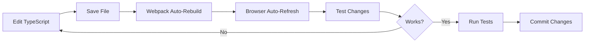

# Getting Started

**Volume I - Chapter 1**
**Purpose:** Environment setup and first successful build

---

## Prerequisites

### Required Software

**Node.js & npm:**
- **Version:** Node 18.0.0+ (LTS recommended)
- **npm:** 9.0.0+
- **Download:** https://nodejs.org/

**Git:**
- **Version:** 2.30+
- **Download:** https://git-scm.com/downloads

**Code Editor (Recommended):**
- **VS Code:** https://code.visualstudio.com/
- **Extensions:**
  - TypeScript and JavaScript Language Features (built-in)
  - ESLint
  - Prettier - Code Formatter
  - Jest Runner
  - Path Intellisense

**Browser (for testing):**
- Chrome 90+ (recommended for development)
- Firefox 88+
- Safari 14+
- Edge 90+

---

## Project Setup

### 1. Clone Repository

```bash
# Clone the repository
git clone https://github.com/your-org/Overlord.git
cd Overlord

# Verify you're on the correct branch
git branch --show-current
# Should show: main or epic/X-name

# Check project structure
ls
# You should see: Overlord.Phaser/, design-docs/, CLAUDE.md, etc.
```

### 2. Navigate to Phaser Project

```bash
cd Overlord.Phaser

# Verify package.json exists
cat package.json | grep "overlord-phaser"
# Should show: "name": "overlord-phaser"
```

### 3. Install Dependencies

```bash
# Install all npm packages (takes 1-2 minutes)
npm install

# Verify installation
npm list phaser
# Should show: phaser@3.85.2

# Check for vulnerabilities (optional)
npm audit
```

**Expected Output:**
```
added 450 packages in 45s

50 packages are looking for funding
  run `npm fund` for details

found 0 vulnerabilities
```

---

## First Build

### Run Development Server

```bash
# Start Webpack dev server (port 8080)
npm start
```

**Expected Output:**
```
> overlord-phaser@0.1.0 start
> webpack serve --mode development

<i> [webpack-dev-server] Project is running at:
<i> [webpack-dev-server] Loopback: http://localhost:8080/
<i> [webpack-dev-server] On Your Network: http://192.168.1.100:8080/
<i> [webpack-dev-server] Content not from webpack is served from 'C:\dev\GIT\Overlord\Overlord.Phaser\public' directory

webpack 5.91.0 compiled successfully in 4521 ms
```

**What Just Happened:**
1. Webpack bundled TypeScript files into JavaScript
2. Development server started at http://localhost:8080
3. Browser automatically opened (or manually open http://localhost:8080)
4. Hot Module Replacement (HMR) enabled (changes auto-reload)

### Verify Game Loads

**Browser Console (F12):**
```
Phaser v3.85.2 - WebGL
[GalaxyMapScene] Using campaign state: Difficulty=Normal, AI=Balanced
```

**Expected Visuals:**
- Starfield background (black with white stars)
- 4-6 planets rendered with labels
- Turn HUD showing "Turn 1 - Action Phase"
- Resource HUD showing starting resources
- Planet info panel (when planet selected)

---

## Run Tests

### Full Test Suite

```bash
# Run all 835 tests (takes ~30 seconds)
npm test
```

**Expected Output:**
```
PASS  tests/unit/Position3D.test.ts
PASS  tests/unit/TurnSystem.test.ts
PASS  tests/unit/CombatSystem.test.ts
...

Test Suites: 85 passed, 85 total
Tests:       835 passed, 835 total
Snapshots:   0 total
Time:        28.456 s
```

### Watch Mode (Recommended for Development)

```bash
# Run tests in watch mode (re-runs on file changes)
npm run test:watch
```

**Usage:**
- Press `a` to run all tests
- Press `p` to filter by filename pattern
- Press `t` to filter by test name pattern
- Press `q` to quit

### Coverage Report

```bash
# Generate HTML coverage report
npm run test:coverage

# Open coverage report (Windows)
start coverage/lcov-report/index.html

# Or manually navigate to:
# Overlord.Phaser/coverage/lcov-report/index.html
```

**Coverage Targets:**
- Overall: 70%+ (currently 93%+)
- Core systems: 90%+
- Models: 80%+
- Scenes: 50%+

---

## Production Build

```bash
# Build for production deployment
npm run build

# Verify build succeeded
ls dist
# Should show: main.js, index.html, assets/
```

**Output Directory:**
```
dist/
├── index.html          # Entry point
├── main.js             # Bundled JavaScript (minified)
├── main.js.map         # Source map for debugging
└── assets/             # Static assets (images, audio)
```

**Build Optimizations:**
- TypeScript compiled to ES6
- Code minified and tree-shaken
- Source maps generated for debugging
- Assets copied from `public/` directory

**Deploy to Vercel:**
```bash
# Install Vercel CLI (if not already installed)
npm install -g vercel

# Deploy (follow prompts)
vercel

# Production deployment
vercel --prod
```

---

## Development Workflow

### Typical Development Cycle



### Hot Module Replacement (HMR)

**How It Works:**
1. Edit `src/core/TurnSystem.ts`
2. Save file (Ctrl+S)
3. Webpack detects change (~2 seconds)
4. Browser refreshes automatically
5. Game state preserved (in most cases)

**HMR Caveats:**
- Sometimes game state resets (expected)
- Syntax errors prevent reload (check console)
- Full refresh may be needed for scene changes

### Debugging

**Browser DevTools (F12):**
```javascript
// Access global game instance (set by main.ts)
window.game

// Access current scene
const scene = window.game.scene.getScene('GalaxyMapScene');

// Access GameState
scene.gameState

// Check planet data
scene.gameState.planets
```

**VS Code Debugging:**
1. Set breakpoints in TypeScript files
2. Run "Launch Chrome" debug configuration
3. Use F5 to start, F10 to step over, F11 to step into

**Source Maps:**
- Enabled in development mode (`eval-source-map`)
- TypeScript files visible in browser DevTools Sources tab
- Set breakpoints directly in TypeScript code

---

## Project Structure Quick Reference

```
Overlord.Phaser/
├── src/
│   ├── core/              # 18 platform-agnostic game systems
│   │   ├── models/        # TypeScript interfaces, enums
│   │   ├── GameState.ts   # Central state container
│   │   ├── TurnSystem.ts
│   │   ├── CombatSystem.ts
│   │   └── ...
│   ├── scenes/            # Phaser presentation layer
│   │   ├── ui/            # Reusable UI components
│   │   ├── BootScene.ts
│   │   ├── GalaxyMapScene.ts
│   │   └── ...
│   ├── config/
│   │   └── PhaserConfig.ts
│   └── main.ts            # Entry point
├── tests/
│   ├── unit/              # Core system tests
│   └── integration/       # Multi-system tests
├── public/                # Static assets
│   ├── index.html
│   └── assets/
├── package.json
├── tsconfig.json          # TypeScript configuration
├── webpack.config.js      # Webpack bundler config
└── jest.config.js         # Jest test configuration
```

---

## Common Issues & Solutions

### Issue: `npm install` fails with permission error

**Solution (Windows):**
```bash
# Run as Administrator
npm install

# Or clean npm cache
npm cache clean --force
npm install
```

**Solution (Mac/Linux):**
```bash
# Don't use sudo with npm!
# Instead, fix npm permissions
mkdir ~/.npm-global
npm config set prefix '~/.npm-global'
export PATH=~/.npm-global/bin:$PATH
npm install
```

---

### Issue: `npm start` port 8080 already in use

**Solution:**
```bash
# Find process using port 8080 (Windows)
netstat -ano | findstr :8080
taskkill /PID <PID> /F

# Or use different port
PORT=3000 npm start
```

**Webpack Config Edit:**
```javascript
// webpack.config.js
devServer: {
  port: 3000,  // Change from 8080
  ...
}
```

---

### Issue: Browser shows blank screen

**Debugging Steps:**
1. Open browser console (F12)
2. Check for JavaScript errors
3. Verify `dist/main.js` exists
4. Clear browser cache (Ctrl+Shift+Delete)
5. Try incognito/private window

**Common Causes:**
- TypeScript compilation error (check terminal)
- Missing assets in `public/` directory
- Browser cache outdated

---

### Issue: Tests fail with "Cannot find module"

**Solution:**
```bash
# Rebuild TypeScript
npm run build

# Clear Jest cache
npx jest --clearCache

# Reinstall dependencies
rm -rf node_modules package-lock.json
npm install
```

**Check TypeScript Paths:**
```json
// tsconfig.json
{
  "compilerOptions": {
    "paths": {
      "@core/*": ["src/core/*"],
      "@scenes/*": ["src/scenes/*"],
      "@config/*": ["src/config/*"]
    }
  }
}
```

---

### Issue: HMR not working (changes don't auto-reload)

**Solution:**
```bash
# Restart dev server
npm start

# Check webpack config
# Ensure devServer.hot is true
```

**Manual Refresh:**
- Press `Ctrl+R` in browser
- Or `Ctrl+Shift+R` for hard refresh

---

## Editor Configuration

### VS Code Settings (`.vscode/settings.json`)

```json
{
  "editor.formatOnSave": true,
  "editor.codeActionsOnSave": {
    "source.fixAll.eslint": true
  },
  "typescript.tsdk": "node_modules/typescript/lib",
  "typescript.enablePromptUseWorkspaceTsdk": true,
  "jest.autoRun": {
    "watch": true,
    "onSave": "test-src-file"
  }
}
```

### Recommended Extensions

**Install via VS Code Command Palette (Ctrl+Shift+P):**
```
ext install esbenp.prettier-vscode
ext install dbaeumer.vscode-eslint
ext install orta.vscode-jest
ext install ms-vscode.vscode-typescript-next
```

---

## Next Steps

After successful setup:
1. Read [Architecture Overview](02-architecture-overview.md) to understand system design
2. Explore [Core Systems Reference](03-core-systems-reference.md) for detailed system docs
3. Review [Testing Guide](06-testing-guide.md) for TDD workflow
4. Try modifying a simple system (e.g., increase starting resources in `CampaignInitializer.ts`)

### Quick Experiment

**Goal:** Increase player starting credits from 10000 to 50000

**Steps:**
1. Edit `src/core/CampaignInitializer.ts`
2. Find line: `playerFaction.resources.credits = 10000;`
3. Change to: `playerFaction.resources.credits = 50000;`
4. Save file (Webpack auto-rebuilds)
5. Refresh browser
6. Verify resource HUD shows 50000 credits

**Success!** You've made your first code change.

---

## Additional Resources

**Documentation:**
- [Phaser 3 API Docs](https://photonstorm.github.io/phaser3-docs/)
- [TypeScript Handbook](https://www.typescriptlang.org/docs/)
- [Jest Documentation](https://jestjs.io/docs/getting-started)
- [Webpack Guides](https://webpack.js.org/guides/)

**Project-Specific:**
- `CLAUDE.md` - AI-assisted development guidance
- `design-docs/artifacts/prd.md` - Product requirements
- `design-docs/artifacts/game-architecture.md` - Architecture decisions

**Community:**
- [Phaser Discord](https://discord.gg/phaser)
- [TypeScript Discord](https://discord.gg/typescript)

---

**Chapter Status:** Complete
**Setup Time:** 10-15 minutes
**Verified Platforms:** Windows 10/11, macOS 12+, Ubuntu 22.04
