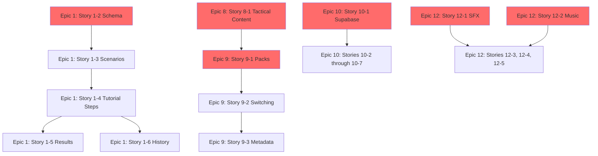

# Open Items Overview

**Volume II - Chapter 1**
**Purpose:** Complete breakdown of remaining development work

---

## Executive Summary

**Total Remaining Work:** 21 stories across 5 epics
**Estimated Human Time:** 10-15 hours (content creation)
**Estimated AI Development Time:** 26-35 hours (implementation + testing)
**Critical Path:** Epic 1 (Tutorials) → Epic 8 (Tactical Scenarios) → Epics 9, 10, 12 (parallel)

**Current Status (December 2025):**
- 7 of 12 epics complete (58%)
- 835 tests passing (93%+ coverage)
- Core gameplay loop functional
- Combat and AI systems operational

---

## Epics Remaining

### Epic 1: Player Onboarding & Tutorials

**Priority:** HIGH (Critical for new players)
**Status:** 1 of 6 stories complete
**Blocker:** Requires human-created content (scenario JSON, tutorial steps)

| Story | Status | Human Task | Estimate |
|-------|--------|------------|----------|
| 1-1: Flash Conflicts Menu | DONE | N/A | Completed |
| 1-2: Scenario Selection Interface | DRAFTED | JSON schema definition | 45 min |
| 1-3: Scenario Initialization | DRAFTED | Tutorial scenario configs (2-3 files) | 30-45 min |
| 1-4: Tutorial Step Guidance | DRAFTED | Step-by-step tutorial content | 90-120 min |
| 1-5: Completion Results Display | DRAFTED | Depends on 1-3 | N/A (autonomous) |
| 1-6: Completion History Tracking | DRAFTED | Depends on 1-3 + Supabase | N/A (autonomous) |

**Human Deliverables:**
1. **Scenario JSON Schema** (`src/data/schemas/scenario-schema.json`)
   - Define required fields (scenarioId, name, type, difficulty, objectives, etc.)
   - Specify victory condition formats
   - Document star rating targets (time-based)

2. **Tutorial Scenario Files** (`src/data/scenarios/tutorial-*.json`)
   - Tutorial 01: Basic Combat (learn platoon commissioning, invasion)
   - Tutorial 02: Planetary Management (learn buildings, resources)
   - Tutorial 03: Fleet Operations (learn spacecraft, navigation)

3. **Tutorial Step Content** (`src/data/tutorials/tutorial-*-steps.json`)
   - Step-by-step guidance text
   - UI element highlighting instructions
   - Action triggers for step progression

**Template Example:**

```json
{
  "scenarioId": "tutorial-01-basic-combat",
  "name": "Basic Combat Tutorial",
  "type": "tutorial",
  "difficulty": "easy",
  "duration": "5-10 min",
  "description": "Learn to commission platoons and execute planetary invasions.",
  "objectives": {
    "primary": "Defeat the AI platoon on Planet Beta",
    "secondary": [
      "Complete with no casualties",
      "Win in under 5 minutes"
    ]
  },
  "initialSetup": {
    "playerPlanets": ["Alpha"],
    "enemyPlanets": ["Beta"],
    "playerResources": {
      "credits": 5000,
      "minerals": 2000,
      "fuel": 1000,
      "food": 500,
      "energy": 500
    },
    "playerStartingUnits": [
      {
        "type": "platoon",
        "planet": "Alpha",
        "equipment": "standard",
        "weapons": "standard",
        "training": "standard",
        "troopCount": 300
      }
    ]
  },
  "victoryConditions": {
    "type": "elimination",
    "target": "All enemy forces destroyed"
  },
  "starTargets": {
    "threeStars": 300,
    "twoStars": 600
  }
}
```

---

### Epic 8: Quick-Play Tactical Scenarios

**Priority:** MEDIUM (Content variety, post-tutorial)
**Status:** 0 of 1 stories complete
**Blocker:** Requires tactical scenario JSON files

| Story | Status | Human Task | Estimate |
|-------|--------|------------|----------|
| 8-1: Tactical Scenario Content | DRAFTED | 4-6 tactical scenario files | 2-3 hours |

**Human Deliverables:**
1. **Tactical Scenario Files** (`src/data/scenarios/tactical-*.json`)
   - Tactical 01: Defend the Colony (survival scenario)
   - Tactical 02: Resource Rush (economic challenge)
   - Tactical 03: Fleet Superiority (space combat focus)
   - Tactical 04: Economic Victory (reach resource thresholds)
   - Tactical 05: Time Trial (capture all planets in X turns)
   - Tactical 06: Guerrilla Warfare (win with limited forces)

**Scenario Themes:**
- **Defensive Challenges:** Hold out against superior forces
- **Economic Puzzles:** Optimize resource generation under constraints
- **Combat Tactics:** Use terrain, aggression levels, unit composition
- **Time Pressure:** Complete objectives within turn limits
- **Asymmetric Warfare:** Overcome disadvantages with strategy

**Example Tactical Scenario:**

```json
{
  "scenarioId": "tactical-01-defend-colony",
  "name": "Defend the Colony",
  "type": "tactical",
  "difficulty": "medium",
  "duration": "10-15 min",
  "description": "The enemy is launching a massive assault. Hold your colony for 10 turns.",
  "objectives": {
    "primary": "Survive for 10 turns with at least one planet",
    "secondary": [
      "Destroy all attacking forces",
      "Keep all planets under your control"
    ]
  },
  "initialSetup": {
    "playerPlanets": ["Alpha", "Beta"],
    "enemyPlanets": ["Gamma", "Delta", "Epsilon"],
    "playerResources": {
      "credits": 8000,
      "minerals": 4000,
      "fuel": 2000,
      "food": 1000,
      "energy": 1000
    },
    "enemyResources": {
      "credits": 15000,
      "minerals": 8000,
      "fuel": 5000,
      "food": 3000,
      "energy": 3000
    },
    "playerStartingUnits": [
      {
        "type": "platoon",
        "planet": "Alpha",
        "equipment": "advanced",
        "weapons": "advanced",
        "training": "standard",
        "troopCount": 400
      },
      {
        "type": "platoon",
        "planet": "Beta",
        "equipment": "standard",
        "weapons": "standard",
        "training": "standard",
        "troopCount": 300
      }
    ],
    "playerStartingBuildings": [
      { "planet": "Alpha", "building": "DefenseGrid" },
      { "planet": "Beta", "building": "MiningStation" }
    ]
  },
  "victoryConditions": {
    "type": "survival",
    "turns": 10,
    "minimumPlanets": 1
  },
  "starTargets": {
    "threeStars": 600,
    "twoStars": 900
  }
}
```

---

### Epic 9: Scenario Pack System

**Priority:** MEDIUM (Content extensibility)
**Status:** 0 of 3 stories complete
**Blocker:** Requires scenario pack JSON files

| Story | Status | Human Task | Estimate |
|-------|--------|------------|----------|
| 9-1: Pack Browsing/Selection | DRAFTED | 2-3 pack JSON files | 1-2 hours |
| 9-2: Pack Switching Runtime | DRAFTED | Depends on 9-1 | N/A (autonomous) |
| 9-3: Pack Metadata Display | DRAFTED | Depends on 9-1 | N/A (autonomous) |

**Human Deliverables:**
1. **Scenario Pack Files** (`src/data/packs/pack-*.json`)
   - Pack 01: Aggressive Warlord (offensive AI, sparse resources)
   - Pack 02: Defensive Strategist (defensive AI, rich resources)
   - Pack 03: Balanced Conquest (standard settings)

**Pack JSON Schema:**

```json
{
  "packId": "aggressive-warlord",
  "name": "Aggressive Warlord",
  "factionLeader": "Commander Vex",
  "description": "Face a ruthless AI opponent who prioritizes military expansion and rapid attacks. Sparse resources force difficult strategic choices.",
  "difficulty": "hard",
  "featured": true,
  "version": "1.0.0",
  "author": "Overlord Team",
  "aiConfig": {
    "personality": "Aggressive",
    "difficulty": "Hard",
    "modifiers": {
      "aggressionBonus": 25,
      "economicFocus": -15,
      "militaryFocus": 40,
      "defenseReduction": -10
    }
  },
  "galaxyTemplate": {
    "planetCount": { "min": 4, "max": 5 },
    "planetTypes": ["barren", "volcanic", "temperate"],
    "resourceAbundance": "scarce",
    "startingSeparation": "close"
  },
  "colorTheme": "0xff4444",
  "portraitUrl": "assets/portraits/vex.png",
  "loreBlurb": "Commander Vex leads the Red Legion, a militaristic faction known for swift, brutal conquests. Diplomacy is weakness. Victory is inevitable."
}
```

**AI Personality Configurations:**

| Personality | Attack Frequency | Economic Priority | Defense Priority | Special Behavior |
|-------------|------------------|-------------------|------------------|------------------|
| Aggressive | High (every 3-4 turns) | Low (20%) | Low (20%) | Rushes military, early attacks |
| Defensive | Low (only if attacked) | Medium (30%) | High (50%) | Fortifies planets, tech upgrades |
| Economic | Medium (if overwhelming) | High (50%) | Low (20%) | Maximizes income, late-game power |
| Balanced | Medium (opportunistic) | Medium (35%) | Medium (35%) | Adapts to player strategy |

---

### Epic 10: User Accounts & Cloud Saves

**Priority:** LOW (Quality of life, not MVP critical)
**Status:** 0 of 7 stories complete
**Blocker:** Requires Supabase project setup (30 min human task)

| Story | Status | Human Task | Estimate |
|-------|--------|------------|----------|
| 10-1: User Account Creation | DRAFTED | Supabase project setup | 30 min setup |
| 10-2: Login/Authentication | DRAFTED | Depends on 10-1 | N/A (autonomous) |
| 10-3: Save Game to Cloud | DRAFTED | Depends on 10-1 | N/A (autonomous) |
| 10-4: Load Game from Cloud | DRAFTED | Depends on 10-1 | N/A (autonomous) |
| 10-5: Cross-Device Sync | DRAFTED | Depends on 10-1 | N/A (autonomous) |
| 10-6: User Settings Persistence | DRAFTED | Depends on 10-1 | N/A (autonomous) |
| 10-7: Statistics Tracking | DRAFTED | Depends on 10-1 | N/A (autonomous) |

**Human Deliverables:**
1. **Supabase Project Setup** (one-time, 30 minutes)
   - Create account at https://supabase.com
   - Create new project named "Overlord"
   - Enable Email/Password authentication
   - Copy Project URL and Anon Key
   - Create database schema (SQL provided in guide)

2. **Configuration File** (`src/config/supabase.ts`)

```typescript
// src/config/supabase.ts
export const SUPABASE_CONFIG = {
  url: 'https://YOUR_PROJECT_ID.supabase.co',
  anonKey: 'YOUR_ANON_KEY_HERE'
};
```

**Database Schema (Run in Supabase SQL Editor):**

```sql
-- Users table (extends Supabase auth.users)
CREATE TABLE user_profiles (
  id UUID REFERENCES auth.users(id) PRIMARY KEY,
  display_name TEXT,
  created_at TIMESTAMP DEFAULT NOW(),
  last_login TIMESTAMP
);

-- Campaign saves
CREATE TABLE campaign_saves (
  id UUID DEFAULT gen_random_uuid() PRIMARY KEY,
  user_id UUID REFERENCES auth.users(id) ON DELETE CASCADE,
  save_name TEXT,
  save_data JSONB,
  turn_number INTEGER,
  created_at TIMESTAMP DEFAULT NOW(),
  updated_at TIMESTAMP DEFAULT NOW()
);

-- Scenario completions
CREATE TABLE scenario_completions (
  id UUID DEFAULT gen_random_uuid() PRIMARY KEY,
  user_id UUID REFERENCES auth.users(id) ON DELETE CASCADE,
  scenario_id TEXT,
  completed BOOLEAN,
  completion_time_seconds INTEGER,
  star_rating INTEGER CHECK (star_rating >= 0 AND star_rating <= 3),
  attempts INTEGER DEFAULT 1,
  best_time_seconds INTEGER,
  completed_at TIMESTAMP DEFAULT NOW()
);

-- User settings
CREATE TABLE user_settings (
  user_id UUID REFERENCES auth.users(id) PRIMARY KEY ON DELETE CASCADE,
  settings JSONB,
  updated_at TIMESTAMP DEFAULT NOW()
);

-- Indexes for performance
CREATE INDEX idx_campaign_saves_user ON campaign_saves(user_id);
CREATE INDEX idx_scenario_completions_user ON scenario_completions(user_id);
CREATE INDEX idx_scenario_completions_scenario ON scenario_completions(scenario_id);

-- Row Level Security (RLS) policies
ALTER TABLE campaign_saves ENABLE ROW LEVEL SECURITY;
ALTER TABLE scenario_completions ENABLE ROW LEVEL SECURITY;
ALTER TABLE user_settings ENABLE ROW LEVEL SECURITY;

-- Users can only access their own data
CREATE POLICY "Users can read own saves" ON campaign_saves
  FOR SELECT USING (auth.uid() = user_id);

CREATE POLICY "Users can insert own saves" ON campaign_saves
  FOR INSERT WITH CHECK (auth.uid() = user_id);

CREATE POLICY "Users can update own saves" ON campaign_saves
  FOR UPDATE USING (auth.uid() = user_id);

CREATE POLICY "Users can delete own saves" ON campaign_saves
  FOR DELETE USING (auth.uid() = user_id);

-- Repeat for other tables
CREATE POLICY "Users can read own completions" ON scenario_completions
  FOR SELECT USING (auth.uid() = user_id);

CREATE POLICY "Users can insert own completions" ON scenario_completions
  FOR INSERT WITH CHECK (auth.uid() = user_id);

CREATE POLICY "Users can read own settings" ON user_settings
  FOR SELECT USING (auth.uid() = user_id);

CREATE POLICY "Users can insert own settings" ON user_settings
  FOR INSERT WITH CHECK (auth.uid() = user_id);

CREATE POLICY "Users can update own settings" ON user_settings
  FOR UPDATE USING (auth.uid() = user_id);
```

**Supabase Free Tier Limits:**
- 500 MB database storage (10,000+ save games)
- 500 concurrent connections
- 2 GB file storage
- 1 GB bandwidth/month

**Sufficient for:** MVP and early growth (0-1,000 players)
**Upgrade needed at:** ~1,000 concurrent users (Supabase Pro: $25/month)

---

### Epic 12: Audio & Atmospheric Immersion

**Priority:** LOW (Polish, not MVP critical)
**Status:** 0 of 5 stories complete
**Blocker:** Requires audio files (MP3/OGG)

| Story | Status | Human Task | Estimate |
|-------|--------|------------|----------|
| 12-1: Sound Effects | DRAFTED | 8+ SFX files (MP3/OGG) | 1-2 hours |
| 12-2: Background Music | DRAFTED | 3+ music tracks (loopable) | 2-3 hours |
| 12-3: Volume Controls | DRAFTED | Depends on 12-1, 12-2 | N/A (autonomous) |
| 12-4: Mute Functionality | DRAFTED | Depends on 12-1, 12-2 | N/A (autonomous) |
| 12-5: Browser Audio Activation | DRAFTED | Depends on 12-1, 12-2 | N/A (autonomous) |

**Human Deliverables:**
1. **Sound Effects** (`public/assets/audio/sfx/*.mp3`)
   - Button click/hover (UI feedback)
   - Platoon commissioned (military action)
   - Building constructed (construction complete)
   - Spacecraft launch (movement initiated)
   - Combat explosion (battle action)
   - Victory fanfare (scenario complete)
   - Defeat sound (scenario failed)
   - Resource collected (economy event)

2. **Background Music** (`public/assets/audio/music/*.mp3`)
   - Main menu theme (ambient, welcoming)
   - Galaxy map theme (strategic, contemplative)
   - Combat music (intense, action-oriented)

**Audio Requirements:**
- Format: MP3 (128-192 kbps) or OGG Vorbis
- Max file size: 2MB per track (web performance)
- Loopable music: Seamless loop points (no clicks/pops)
- Normalized volume: -14 LUFS (industry standard)
- License: CC0 or public domain (verify distribution rights)

**Free Audio Sources:**
- **Sound Effects:** Freesound.org, OpenGameArt.org, BFXR (retro generator)
- **Music:** Incompetech.com (Kevin MacLeod), FreePD.com, BenSound.com
- **Tools:** Audacity (editing), ChipTone (retro SFX), MuseScore (MIDI to audio)

**Audio Manifest** (`public/assets/audio/audio-manifest.json`):

```json
{
  "soundEffects": {
    "ui": {
      "buttonClick": "assets/audio/sfx/button-click.mp3",
      "buttonHover": "assets/audio/sfx/button-hover.mp3"
    },
    "military": {
      "platoonCommissioned": "assets/audio/sfx/platoon-commissioned.mp3",
      "spacecraftLaunch": "assets/audio/sfx/spacecraft-launch.mp3"
    },
    "combat": {
      "explosion": "assets/audio/sfx/combat-explosion.mp3"
    },
    "economy": {
      "buildingConstructed": "assets/audio/sfx/building-constructed.mp3"
    },
    "scenario": {
      "victory": "assets/audio/sfx/victory-fanfare.mp3",
      "defeat": "assets/audio/sfx/defeat-sound.mp3"
    }
  },
  "musicTracks": {
    "mainMenu": "assets/audio/music/main-menu-theme.mp3",
    "galaxyMap": "assets/audio/music/galaxy-map-theme.mp3",
    "combat": "assets/audio/music/combat-theme.mp3"
  },
  "defaultTrack": "galaxyMap",
  "version": "1.0.0"
}
```

---

## Dependency Chain



**Legend:**
- Red nodes: Human tasks required
- Blue nodes: Autonomous implementation (AI-assisted)

---

## Recommended Execution Order

### Phase 1: Critical Path (Weeks 1-2)
**Goal:** Enable full tutorial system

1. Epic 1: Story 1-2 (45 min) - Scenario JSON schema
2. Epic 1: Story 1-3 (30-45 min) - Tutorial scenario configs
3. Epic 1: Story 1-4 (90-120 min) - Tutorial step content
4. AI implements Stories 1-5, 1-6 (autonomous, 6-8 hours)

**Deliverable:** Complete tutorial system, new players can learn the game

---

### Phase 2: Content Variety (Weeks 3-4)
**Goal:** Add quick-play scenarios and scenario packs

5. Epic 8: Story 8-1 (2-3 hours) - Tactical scenario files
6. AI implements Epic 8 completion tracking (autonomous, 2-3 hours)
7. Epic 9: Story 9-1 (1-2 hours) - Scenario pack files
8. AI implements Stories 9-2, 9-3 (autonomous, 4-6 hours)

**Deliverable:** Quick-play scenarios and AI variety packs available

---

### Phase 3: Polish & Infrastructure (Weeks 5-6)
**Goal:** Cloud saves and audio

9. Epic 10: Story 10-1 (30 min) - Supabase setup
10. AI implements Stories 10-2 through 10-7 (autonomous, 8-10 hours)
11. Epic 12: Stories 12-1, 12-2 (3-5 hours) - Audio files
12. AI implements Stories 12-3, 12-4, 12-5 (autonomous, 6-8 hours)

**Deliverable:** Cloud saves functional, audio/music integrated

---

## Total Time Estimates

**Human Content Creation:** 10-15 hours
**AI Development Time:** 26-35 hours
**Grand Total:** 36-50 hours (serial execution)

**Parallelized (Multiple Contributors):**
- Human tasks can run in parallel (reduce to 6-9 hours)
- AI development still serial (26-35 hours)
- **Total:** 32-44 hours

---

## Quality Gates

### Definition of Done (Per Story)

**Human Content:**
- [ ] JSON files valid (no syntax errors)
- [ ] Follows schema definition
- [ ] Playtested (scenario completable)
- [ ] Committed to git repository

**AI Implementation:**
- [ ] All acceptance criteria met
- [ ] Tests written (TDD - test-first)
- [ ] 70%+ code coverage maintained
- [ ] npm test passes (all 835+ tests)
- [ ] npm run build succeeds (no errors)
- [ ] Code review approved (architecture compliance)

---

## Next Steps

1. Review detailed guides:
   - [03: Scenario Authoring](03-scenario-authoring.md)
   - [04: Scenario Pack Creation](04-scenario-pack-creation.md)
   - [06: Audio Assets](06-audio-assets.md)
   - [07: Supabase Integration](07-supabase-integration.md)

2. Pick a task from [02: Task Backlog](02-task-backlog.md)

3. Follow [08: Contributing Guide](08-contributing-guide.md) for workflow

---

**Chapter Status:** Complete
**Epics Remaining:** 5 (Epics 1, 8, 9, 10, 12)
**Stories Remaining:** 21
**Human Tasks Documented:** Yes (with time estimates)
**Dependency Chain:** Fully mapped
